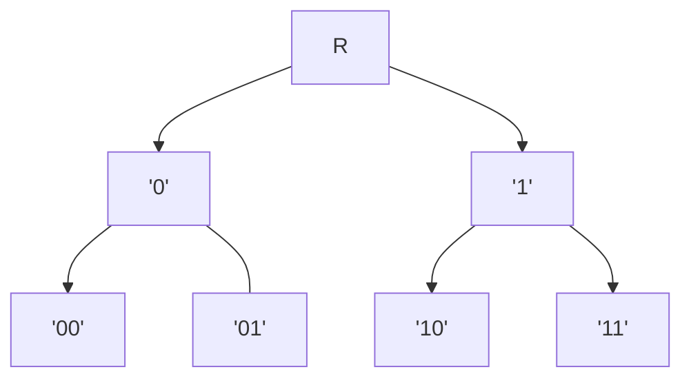

#					 HFTrie 

A dynamic data structure for indexing 64-bit binary codes for
efficient nearest neighbor search.  The index offers the capability
to add, delete and range search for all points within a given radius
of a target point. 


## 	              Description

The HFTrie is a data structure where the indexed elements - or data points - are
treated as a sequence of bits.  Each layer of the trie sorts the data points according
to a prefix portion of bits.  For example, layer one sorts the data point into a subnode
corresponding to the value of its first bit.  The second layer sorts the datapoints into
the subnode for the value of its first two bits.  And so on.  



That's the basic idea, but for efficiency, the bits are chunked together. So, instead
of considering only one bit per level, multiple bits (e.g. 4) are used from the successive
bits to sort the items.  This naturally increases the fanout of each node.  For two bits
per layer, each node will sort into four possible child nodes.  For 4 bits per layer, there
are 16 possible child nodes.  And so on. 


## 		  		  Performance

Here is a comparison of four indexing structures using a data set of 1 million randomly
generated 64-bit integers.  To test the range search ability,  10 clusters of 10
integers are added to the index.  These clusters are generated by first randomly generating a center
point, and for each point added to the cluster, tweaking the center point in a known number
of bit positions such that no two points differ by more than 10.  The results are
averaged over 5 trial runs, where each trial run entails building the index and querying the
index for the clusters.  


| Index Impl. |  Memory  | pct. build ops | build time  | pct. query ops | avg. query time | 
|-------------|----------|----------------|-------------|----------------|-----------------|
|   MTree     |  25.1MB  |    3318%       |   275ns     |     80.6%      |        6.7ms    |
|   MVPTree   | 680.0MB  |    2923%       |   126$\mu$s |     23.9%      |       70.3ms    |
|   HWTree    |  75.6MB  |     n/a        |     5$\mu$s |     25.3%      |      139.2ms    |
|   HFTrie    |  23.7MB  |     n/a        |   176ns     |    100.0%      |       18.7ms    |


The percentage of build operations are the number of distance calculations required to build the
structure, expressed as a percentage of the total points indexed.  Likewise, the percentage of
query operations reflects the number of distance calculations performed in querying for the clusters.


##                  Install

```
cmake .
make
make test
make install
```

##                 Simple API

```
HFTrie trie;

long long id;
uint64_t code;

// insert an element
trie.Insert({ id, code });

// delete an element
trie.Delete({ id, code });


uint64_t target;
int radius = 10;
vector<hf_t> results trie.RangeSearch(target, radius);

size_t sz = trie.Size();

size_t nbytes = trie.MemoryUsage();

// for debugging
trie.Print(cout);

```

