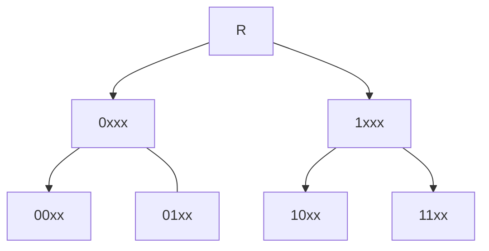

#					 HFTrie 

A dynamic data structure for indexing 64-bit binary codes for
efficient nearest neighbor search.  The index offers the capability
to add, delete and range search for all points within a given radius
of a target point. 


## 	              Description

The HFTrie is a data structure where the indexed elements - or data points - are
treated as a sequence of bits.  Each layer of the trie sorts the data points according
to a prefix portion of bits.  For example, layer one sorts the data point into a subnode
corresponding to the value of its first bit.  The second layer sorts the datapoints into
the subnode for the value of its first two bits.  And so on.  



That's the basic idea, but for efficiency, the bits are chunked together.
So, instead of considering only one bit per level, multiple bits (e.g. 4) are used from the bit sequence
at each level to sort into child nodes.  This naturally increases the fanout of each node.  For two bits
per layer, each node will sort into four possible child nodes.  For 4 bits per layer, there
are 16 possible child nodes.  And so on. 


## 		  		  Performance

Here are the performance metrics for the HFTrie for various index sizes.
The insert and query times are the average times it takes to insert or query the index.
Query Operations is for the average number of distance calculations performed for a range search,
normalized to the size of the index and expressed as a percentage.
The last column is for the recall percentage,
or the average proportion of the cluster that should be returned with each query.
The fast range search sacrfices a bit in accuracy for a significant boost in speed efficiency.   

### Fast Range Search

|  N   |  MEM  | Insert Time |  Query Opers.  |  Query Time  |  Recall  |
|------|-------|-------------|----------------|--------------|----------|
| 100K | 4.0MB |  135 ns  |  0.97%  | 37.1 &mu;s |  87.2%  |
| 200K | 6.5MB |  146 ns  |  0.96%  | 72.9 &mu;s |  89.4%  |
| 400K |  12MB |  172 ns  |  0.89%  | 124 &mu;s  |  88.2%  |
| 800K |  35MB |  241 ns  |  0.43%  | 206 &mu;s  |  86.2%  |
|   1M |  45MB |  263 ns  |  0.34%  | 250 &mu;s  |  86.0%  |
|   2M |  75MB |  297 ns  |  0.30%  | 387 &mu;s  |  86.2%  |
|   4M | 127MB |  330 ns  |  0.30%  | 618 &mu;s  |  85.6%  |
|   8M | 268MB |  373 ns  |  0.25%  | 953 &mu;s  |  85.0%  |
|  16M | 727MB |  461 ns  |  0.11%  |  1.75 ms   |  85.2%  |
|  32M | 1.2GB |  538 ns  |  0.09%  |  3.27 ms   |  86.4%  |
|  64M | 1.9GB |  613 ns  |  0.09%  |  5.21 ms   |  86.4%  |
| 128M | 4.3GB |  674 ns  |  0.08%  |  7.39 ms   |  92.4%  |


For a constant index size, N = 4M, the query performance varies for different radius values.
Better accuracy is guaranteed for lower radius searches with modest reductions in accuracy
for larger range searches.

| Radius | Query Opers. | Query Time | Recall |
|--------|--------------|------------|--------|
|  0 | 0.0003% | 1.46 &mu;s | 100%  |
|  2 | 0.02%   | 49.0 &mu;s | 99.8% |
|  4 | 0.02%   | 434 &mu;s  | 96.6% |
|  6 | 0.30%   | 613 &mu;s  | 93.4% |
|  8 | 0.30%   | 617 &mu;s  | 88.6% |
| 10 | 0.30%   | 616 &mu;s  | 83.2% |
| 12 | 0.30%   | 619 &mu;s  | 88.8% |


### Standard Range Search

A standard range search guarantees query accuracy with significant added
costs to speed.  


|   N  |  MEM  |  Insert time  |  Query Opers.  |  Query Time  |  Recall  |
|------|-------|---------------|----------------|--------------|----------|
| 100K | 4.0MB |  134 ns  |  89.5%  |  3.40 ms |  100%  |
| 200K | 6.5MB |  142 ns  |  89.5%  |  6.54 ms |  100%  |
| 400K |  12MB |  169 ns  |  86.7%  |  11.7 ms |  100%  |
| 800K |  35MB |  238 ns  |  65.7%  |  30.4 ms |  100%  |
|   1M |  45MB |  257 ns  |  60.7%  |  39.7 ms |  100%  |
|   2M |  75MB |  295 ns  |  58.8%  |  68.5 ms |  100%  |
|   4M | 127MB |  327 ns  |  58.6%  |  111 ms  |  100%  |
|   8M | 268MB |  363 ns  |  51.2%  |  191 ms  |  100%  |
|  16M | 727MB |  457 ns  |  29.0%  |  454 ms  |  100%  |
|  32M | 1.2GB |  533 ns  |  27.1%  |  783 ms  |  100%  |
|  64M | 1.9GB |  604 ns  |  27.0%  |  1.29 s  |  100%  |
| 128M | 4.3GB |  665 ns  |  22.8%  |  1.95 s  |  100%  |


### Comparison

Here is a comparison of different methods of indexing a uniform distributed
data set of 4 million.  Query operations notes the number of distance computations
performed per query, normalized to the size of the dataset.  All search queries are
peformed for a radius = 10.  Note that all methods underperform a simple sequential
search at such a large radius. Only the HFTrie's fast range search outperforms the
sequential search with the drawback that it is only able to achieve 85% recall of
all cluster objects for an extended radius.
It is, however, guaranteed to return all exact matches for smaller range searches.


For data set size, N = 4M and query radius = 10:


|  Method     |  MEM  |  Insert Time  |  Query Opers.  |  Query Time  |  Recall  |
|-------------|-------|---------------|----------------|--------------|----------|
| SequentialSearch |  64MB  |  n/a  |  100%  | 9.08 ms  |  100%  |
| [MVPTree](https://github.com/starkdg/mvptree)     |  2.67GB |  43.9&mu;s  | 25.0%  |  276 ms  |  100% |
| [MTree](https://github.com/starkdg/mtree)       |  113MB  |  631ns   |  69.5%  |  68.2 ms  |  100%  |  
| [HWTree](https://github.com/starkdg/hwtree)      |  312MB  |  1.69 &mu;s  |  17.6%  |  222 ms  | 100%  |
| [HFTrie](https://github.com/starkdg/hftrie)-std  |  124MB  |  327 ns  |  58.6%  |  111 ms  |  100%  |
| [HFTrie](https://github.com/starkdg/hftrie)-fast |  124MB  |  330 ns  |  0.30%  |  618 &mu;s  |  85.6%  | 


You can run these tests with the compiled program `runhftrie`.
View the source in [tests/run_hftrie.cpp](https://github.com/starkdg/hftrie/tree/master/tests).  


##                  Install

```
cmake .
make
make test
make install
```

##                 Simple API

```
HFTrie trie;

long long id;
uint64_t code;

// insert an element
trie.Insert({ id, code });

// delete an element
trie.Delete({ id, code });


uint64_t target;
int radius = 10;
vector<hf_t> results trie.RangeSearch(target, radius);

size_t sz = trie.Size();

size_t nbytes = trie.MemoryUsage();

// for debugging
trie.Print(cout);

```

